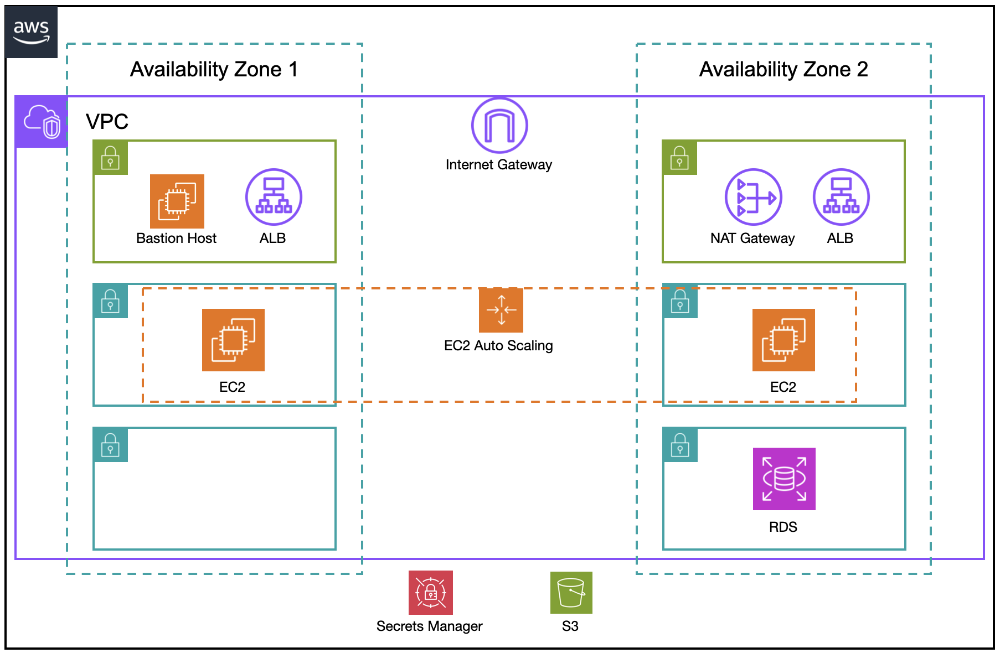

# AWS VPC Deployment with Java Spring Application using Terraform

This project demonstrates how to deploy a Java Spring application in AWS using Terraform. The application is deployed in a custom VPC, which is designed with high availability and scalability. The infrastructure includes multiple Availability Zones, an Application Load Balancer, an Auto Scaling Group, and a managed RDS instance for database storage.

## Table of Contents
- [Architecture](#architecture)
- [Pre-requisites](#pre-requisites)
- [Deployment Steps](#deployment-steps)
  - [1. Provision Infrastructure](#1-provision-infrastructure)
  - [2. Database Setup](#2-database-setup)
  - [3. Application Deployment](#3-application-deployment)
- [Conclusion](#conclusion)

## Architecture



The VPC is structured with the following components:

- **2 Availability Zones**.
- **Subnets**:
  - 1 public and 2 private subnets in each Availability Zone.
- **Internet Gateway**: Provides internet access for public subnets.
- **NAT Gateway**: Located in a public subnet to allow instances in private subnets to access the internet.
- **Bastion Host**: An EC2 instance in a public subnet for secure access to resources in private subnets.
- **Application Load Balancer (ALB)**: Deployed in the public subnets for distributing traffic to instances in private subnets.
- **Auto Scaling Group**: Spanning across both Availability Zones, ensuring scalability of the application.
- **RDS Instance**: A managed relational database deployed in private subnets.

## Pre-requisites

Ensure you have the following installed locally:

- [Terraform](https://www.terraform.io/downloads.html)
- [AWS CLI](https://aws.amazon.com/cli/)
- [Java](https://www.java.com/) installed on your local machine for building the application.
- An AWS account with IAM permissions to create resources such as VPCs, EC2 instances, RDS, etc.

## Deployment Steps

### 1. Provision Infrastructure

First, clone the repository with the Terraform configurations and initialize the infrastructure setup:

```
git clone <your-terraform-repo-url>
cd <terraform-directory>
terraform init
terraform apply
```

### 2. Database Setup

After provisioning the RDS instance, you'll need to connect to it via the Bastion Host to create the database and tables.

- **Connect to the Bastion Host**:

    `ssh -i <bastion-host-key-pair> ec2-user@<bastion-host-public-ip>`

- **Install the MySQL client on the Bastion Host**:

    `sudo dnf install mariadb105`

- **Connect to the RDS instance**:

    `mysql -h <rds-endpoint> -P 3306 -u admin -p`

- Once connected, create the necessary database and tables for your application.

### 3. Application Deployment

You will need to upload the `.jar` file of your Java Spring application and the key pair to the Bastion Host, and from there transfer it to the EC2 instances in the Auto Scaling Group.

- **From your local machine, upload the `.jar` file and key pair to the Bastion Host**:

    `scp -i <bastion-host-key-pair> <instances-key-pair> <application-jar-file> ec2-user@<bastion-host-public-ip>:/home/ec2-user`

- **Connect to the Bastion Host**:

    `ssh -i <bastion-host-key-pair> ec2-user@<bastion-host-public-ip>`

- **Transfer the `.jar` file to one of the Auto Scaling Group instances**:

    `scp -i <instances-key-pair> <application-jar-file> ec2-user@<private-instance-ip>:/home/ec2-user`

- **SSH into the Auto Scaling Group instance and run the application**:

    `ssh -i <instances-key-pair> ec2-user@<private-instance-ip>`
    `java -jar <application-jar-file>`

## Conclusion

This project demonstrates how to deploy a high-availability, scalable Java Spring application in AWS using Terraform. The setup includes a custom VPC, Auto Scaling for fault tolerance, and an RDS instance for database management.

Make sure to replace placeholders like `<bastion-host-key-pair>`, `<application-jar-file>`, and other variable elements with the actual values used in your project. This structure will make it easy for others to understand and replicate your deployment.